<!--
## Hi there 👋
-->

<!--
**hyperbl/hyperbl** is a ✨ _special_ ✨ repository because its `README.md` (this file) appears on your GitHub profile.

Here are some ideas to get you started:

- 🔭 I’m currently working on ...
- 🌱 I’m currently learning ...
- 👯 I’m looking to collaborate on ...
- 🤔 I’m looking for help with ...
- 💬 Ask me about ...
- 📫 How to reach me: ...
- 😄 Pronouns: ...
- ⚡ Fun fact: ...
-->

Hello, I'm hyperbl, an undergraduate student from China.

I major in Electronic Engineering, but... Anyway, here's my GitHub stats card:

And the top languages I have been using are listed as follows:

Just a nobody.
